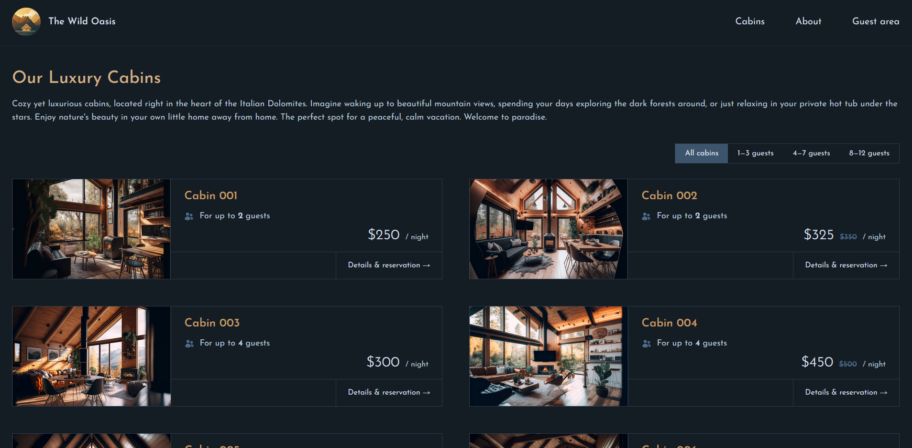
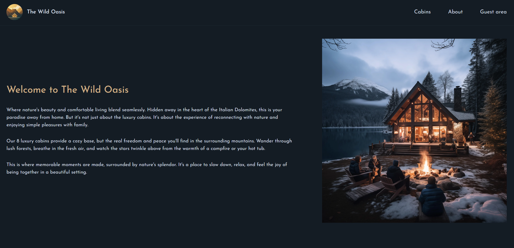
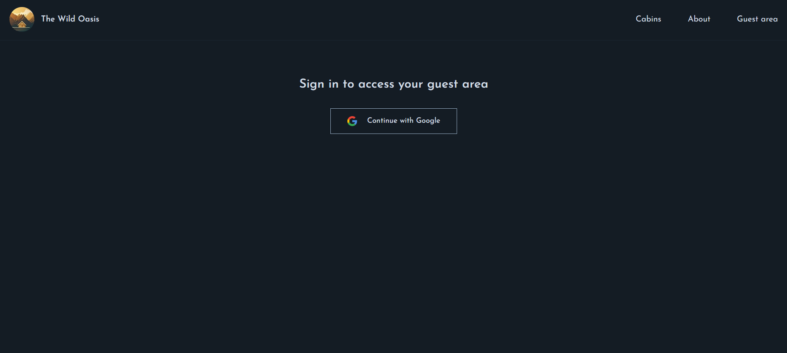
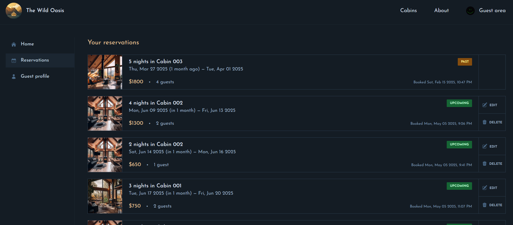

# The Wild Oasis Website

The website for my dashboard project [Check it](https://github.com/MohannadBT/React-the-wild-oasis) and following my react learning path, this time with Next.js

### [The Wild Oasis Website](https://react-the-wild-oasis-website-one.vercel.app/)

## Tools / Libraries

- [Next.js](https://nextjs.org/)
- [Date FNS](https://date-fns.org/)
- [Supabase](https://supabase.com/)
- [React icons](https://react-icons.github.io/react-icons/)

## Overview

